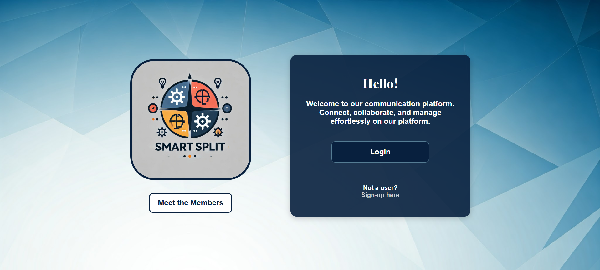

## Project Name: **Smart Split**

### Overview
Smart Split is a user-friendly application designed to help friends and groups manage shared expenses effortlessly. Whether it's for a trip, dinner, or daily expenses, this app ensures transparency by keeping track of who owes whom and allows users to send gentle reminders to settle up.


---

### Features
- **Group Expense Tracking**: Create groups and add shared expenses.
- **Split Options**: Split expenses equally or based on custom shares.
- **Debt Summary**: View a clear summary of who owes whom.
- **Reminders**: Send reminders to friends to settle outstanding amounts.
- **Expense History**: Maintain a detailed record of all transactions.
- **Multi-Currency Support**: Add expenses in different currencies (optional).
  
---

### How It Works
1. **Create a Group**:
   - Add participants to the group.
   - Assign default shares (equal or custom).

2. **Add an Expense**:
   - Enter the total amount, description, and payer.
   - Specify how the expense should be split (equal/custom).

3. **Track Balances**:
   - Check the real-time balance summary to see who owes whom.

4. **Send Reminders**:
   - Click a button to send a friendly reminder to a friend for unpaid debts.

---

### Tech Stack
- **Frontend**: HTML / CSS / Javascript
- **Database**: MyPHPAdmin / MySQL 

---

### Installation
   Clone the repository:  
   ```bash
   git clone https://github.com/panchalbhakti/SmartSplit.git
   cd SmartSplit
   ```


### Future Improvements
- Add QR code-based payment links.
- Introduce expense categorization (e.g., Food, Travel, Shopping).
- Implement machine learning to suggest expense trends and budgeting tips.
- Add support for recurring expenses.

---
